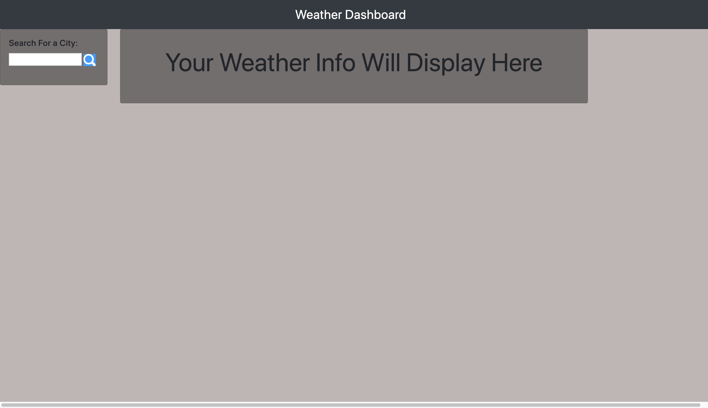

# 6-Weather-Dashboard

## Table of contents
* [Deployed Repo](#deployed-repo)
* [Assignment Info](#assignment-info)
* [Technologies](#technologies)
* [Files](#files)
* [Key Notes](#key-notes)

## Deployed Repo
https://ohhhhhwhen.github.io/6-Weather-Dashboard/

## Assignment info
This application assignment was a Weather Dashboard.
An html that displays the current weather of a desired
location. Depending on what the user searches. Using an
online weather api, I was able to grab various info about
locations using Asynchronous Javascript (ajax). With that I
was able to grab and display the temperature, humidity, 
wind speed, and uv. In addition, the html includes a small
display of the next 5 days in the searched location. With 
basic temperature information.
	
## Technologies
Project is created with:
* Bootstrap v4.4
* Visual Studios Code (HTML/CSS/JS/JQ)
* Google/W3
* Moment.js 
* Weather API
	
## Files / Running Page
* Here are some screen shots of the running page from an images folder:

 

 


## Key Notes
* Bootstrap link for html format

```
$ <link rel="stylesheet" href="https://stackpath.bootstrapcdn.com/bootstrap/4.3.1/css/bootstrap.min.css"
        integrity="sha384-ggOyR0iXCbMQv3Xipma34MD+dH/1fQ784/j6cY/iJTQUOhcWr7x9JvoRxT2MZw1T" crossorigin="anonymous">
```
* Adding the jquery script link to the html page

```
$ <script src="https://cdnjs.cloudflare.com/ajax/libs/jquery/3.2.1/jquery.min.js"></script>
```
* Moments link added for date and time
```
$ <script src="https://cdnjs.cloudflare.com/ajax/libs/moment.js/2.24.0/moment-with-locales.min.js"></script>
```
* AJAX script link
```
$ <script src="https://ajax.googleapis.com/ajax/libs/jquery/3.4.1/jquery.min.js"></script>
```